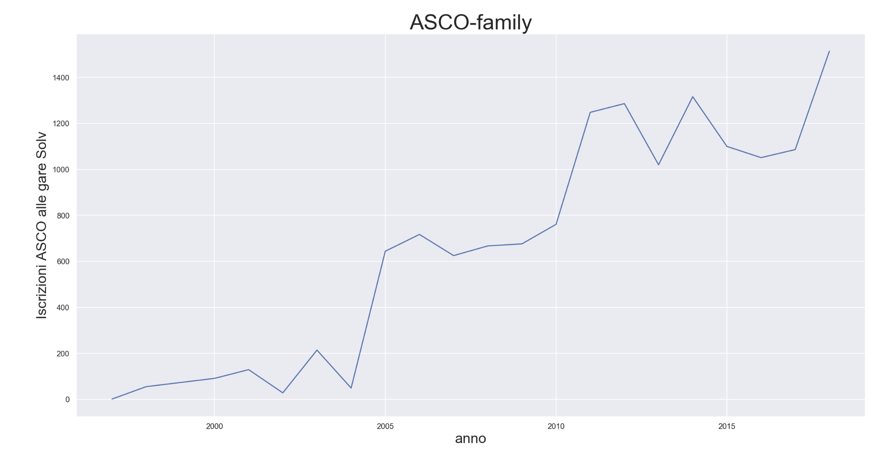

# Benvenuto pASCOlista 😎
 Mi fa molto piacere incontrarti qui! Buon divertimento e ... buon **ASCO** Natale!

### ASCO ❤️ - Tutti noi!
      - Chilometri percorsi: 49'980
      - Dislivello: 1'872'651 metri
      - Tempo: 430 giorni, 17 ore 13 minuti e 40 secondi

#### P**ascol**isti - Chi ha partecipato al maggior numero di eventi di c.o?

| Pos | Nome                  |  Partecipazione |
| :-: | :-:                   | :-:             |
| 🥇  | Silvia Zemp           | 264             |
| 🥈  | Michi Ren             | 262             |
| 🥉  | Stefano Castelli      | 222             |

#### ASCOMolaMia - Chi ha corso più c.o di tutti? 🏃🏃

| Pos |        Nome           |  Tempo                   |
| :-: | :-:                   | :-:                      |
| 1.  | Stefano Brambilla     | 10 giorni, 8 ore e 43 min|
| 2.  | Toncsi Kocsis         | 8 giorni, 10 ore e 40 min  |
| 3.  | Silvia Zemp   | 8 giorni, 8 ore e 26 min         |

#### p**ASCO**loni - pascolata media per gara 🐢🍄🐢

| Pos |        Nome           |  Tempo          |
| :-: | :-:                  | :-:              |
| 1.  | Maja Toscanelli      |     18:28        |
| 2.  | Uccio                |     16:21        |
| 3.  | Gaia Caruso          |     14:22        |
| 4.  | Luca Dolfi           |     13:40        |
| 5.  | Thomas Di Mauro      |     13:01        |

> metrica: il concorrente deve aver partecipato ad almeno 10 gare.
Per ogni intertempo maggiore di 1.25 rispetto al tempo medio della tratta, definisci 'pascolata' come la differenza tra il tempo effettivo del concorrente e il tempo medio.
      Somma assieme tutte le pascolate e dividi in base al numero di gare.

#### AscoHero - Chi è il vero eroe? Chi detiene il record di chilometri percorsi??

| Pos |        Nome           |  Lunghezza      |
| :-: | :-:                   | :-:             |
| 🥇  | Michele Ren           | 1340 km         |
| 🥈  | Stefano Castelli      | 1255 km         |
| 🥉  | Stefano Brambilla     |     1206 km     |

#### AscoIron - chi scala le montagne invece di fare c.o?

| Pos |        Nome        |  Dislivello 🚀  |
| :-: | :-:                | :-:          |
| 1.  | Stefano Castelli   | 55'015 m     |
| 2.  | Michele Ren        | 53'666 m     |
| 3.  | Stefano Brambilla  | 52'540 m     |

#### Tempo di gara più lungo? 👟👟

| Pos |        Nome           |  Tempo    | Evento                |
| :-: | :-:                   | :-:       | :-:                       |
| 🥇  | Barbara Giuganino     | 02:45:21  | 2. Nat, 2009          |
| 🥈  | Marta Schwank         | 02:44:39  | 9. TMO Gribbio, 2018  |
| 🥉  | Michela Bianchi       | 02:41:21  | 9. TMO Gribbio, 2018  |

#### AscoVeriCampioni - Miglior media del rango da **sempre** 🏆

| Pos | Nome                  |  Media    |
| :-: | :-:                   | :-:       |
| 1.  | Mitz                  | 3.7       |
| 2.  | Manu                  | 4.6       |
| 3.  | Elia Ren              | 5         |
| 4.  | Martina Rizzi         | 6         |
| 5.  | Benedetto Castelli    | 6.1       |
| 6.  | Aline Ren             | 6.2       |
| 7.  | Diva Caruso           | 6.4       |

> metrica: media dei ranghi di chi ha corso più di 50 gare.

#### Asco Pigri - Chi non finisce mai le gare? 🤕

| Pos | Nome                  |  Partecipazione  | Non classificato | %       |
| :-: | :-:                   | :-:              |                  |         |
| 1.  | Simone Cattaneo       | 64               | 13               |  20.3%  |
| 2.  | Carlo Guglielmini     | 58               | 11               |  18.9%  |
| 3.  | Gabriele Zanzi        | 130              | 22               |  16.9%  |

> metrica: i concorrenti devono aver fatto almeno 50 gare.

#### Asco Eroi - Chi finisce sempre le gare? 🏆🏆

| Pos | Nome                  |  Partecipazione  | Non classificato | %       |
| :-: | :-:                   | :-:              |                  |         |
| 🥇  | Peter Schrämmli       | 166              | 1                |  0.60%  |
| 🥈  | Anna Beltraminelli    | 161              | 1                |  0.62%  |
| 🥉  | Baba                  | 123              | 1                |  0.81%  |

> metrica: i concorrenti devono aver fatto almeno 100 gare.

## Risultati per il **2018**

#### Pascolisti 2018 - Partecipazione gare

| Pos | Nome                              |  Partecipazione |
| :-: | :-:                               | :-             |
| 1.  | Elia Ren                          | 27             |
| 2.  | Manu & Tommy Besomi               | 22             |
| 3.  | Ian Bianchi & Sofia Chiodoni      | 21             |

#### AscoHero 2018 - chilometri totali!?

| Pos | Nome                  |  Chilometri       |
| :-: | :-:                   | :-:               |
| 1.  | Manu                  | 137 km            |
| 2.  | Tommy Besomi          | 110 km            |
| 3.  | Elia Ren              | 106 km            |

#### AscoIron 2018 - Dislivello totale 🚀

| Pos |        Nome           |  Dislivello   |
| :-: | :-:                   | :-:           |
| 🥇  | Manu                  | 5605m         |
| 🥈  | Stefano Brambilla     | 4165m         |
| 🥉  | Tommy Besomi          | 4090m         |

#### Mola mia 2018 - Tempo di gara totale 👍🏻

| Pos |        Nome           |  Tempo                      |
| :-: | :-:                   | :-:                         |
| 1.  | Michi Bianchi         | 1 giorno, 23 ore e 42 min   |
| 2.  | Sofia Chiodoni        | 20 ore e 52 min             |
| 3.  | Manu                  | 17 ore e 52 min             |

#### AscoVeriCampioni 2018 - Miglior media del rango 🏆

| Pos | Nome            |           |
| :-: | :-:             | :-:       |
| 1.  | Gigi            | 3.8       |
| 2.  | Michi Ren       | 4.4       |
| 3.  | Elia Ren        | 5         |

> metrica: media dei ranghi di chi ha percorso più di 5 gare nel 2018.

### MANCHI TU?? :)
Non risulti nella classifica e/o sei interessato ad un analisi completa e computerizzata dei tuoi risultati di c.o? Scrivimi una email (**jonathanbesomi__AT__gmail.com**) e ti invierò un rapporto personalizzato :)

### Come è stato possibile ottenere questi risultati?
In primis tutti i risultati pubblicati sul sito SOLV (oltre 200 MB di dati) sono stati scaricati localmente, puliti (che fatica!) e salvati in un formato facilmente interpretabile. Successivamente, utilizzando *python* e *pandas* i dati sono stati filtrati per club, trasformati e aggregati fino ad ottenere il risultato sperato.
Se sei interessato a sapere di più non esitare a contattarmi. Ho preferito (per ora) non pubblicare il codice in quanto non sono certo che la pratica eseguita rispetta le condizioni di utilizzazione del portale Solv. Ops.

### Disclaimer
Sebbene ho fatto tutto il possibile per ottenere dati significativi, i risultati della analisi devono essere presi con spirito scherzoso e sportivo. Grazie per la comprensione! 😉
